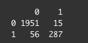

```{r setup, include=FALSE}
knitr::opts_chunk$set(echo = TRUE)

# Remove all variables from the current environment
rm(list = ls())

# For reproducibility
set.seed(8675309)

# Load libraries
packages <- c("tinytex", "tidytext", "textstem", "glue", "lubridate",
              "textclean", "sjmisc", "kableExtra", "rtweet", "TSA", "class",
              "tree", "MASS", "e1071", "tidyverse")

temp <- lapply(packages, function(x) {if (!x %in% row.names(installed.packages()))
  install.packages(x);})

temp <- lapply(packages, library, character.only = TRUE)

# Load relevant data sets
load("tweets_processed.rda")
load("unlabeled_tweets_processed.rda")
load("results_20201201.rda")
load("analysis_tweet_processed.rda")
```

# Introduction

Twitter is a large social media platform that has global reach.  In July of this year, it's estimated that there are around 326 million active accounts (**Hootsuite 2020**).  Individuals use it to express opinions and pass information to other users; companies use it as part of brand outreach and advertising.  In the past four years, the U.S. has seen increased volume of political discourse occurring on Twitter, most noteably by President Donald Trump.  

As this discourse expands, political campaigns (or other entities) may seek to use the medium to gauge public opinion before elections or key policy votes.  Taking the idea a step further, the "follower" structure of Twitter accounts and the "retweet" process make Twitter a natural vector for political ads during campaign season.  However, seeing an ad or an endorsement for a political figure from the official campaign account is different from seeing a new hashtag trend because "so many people are talking about it."  This is where bots come into play.

What are bots?  A bot is a term (as far as Twitter goes) for an account that takes automated action of some sort.  A store may program a bot to Tweet out every Monday morning what items are on sale at the store this week.  There's a botnet (collection of bots with a similar function) which tweets out random Star Wars quotes that has over 350 thousand bots (**Echeverria and Zhou 2017**).  Where bots can have some more disingenuous effects is the use of botnets for "astroturfing."

Astroturfing is described as "organized activity that is intended to create a false impression of a widespread, spontaneously arising, grassroots movement in support of or in opposition to something (such as a political policy) but that is in reality initiated and controlled by a concealed group or organization (such as a corporation)" (**Merriam-Webster 2020**).  There's been a good amount of research concerning the 2016 U.S. presidential election and 2018 midterm elections and the impact of Twitter bots on public sentiment.

The issue I wanted to look at is how these bots are identified.  What attributes of a Twitter account (contents of Tweets, number of followers, account age) can be used to help determine "legitimacy" (meaning if an account is an automated bot or an actual human)?  To this end, I located two lists of `user_id`s from previous research that contained known bots (**Sayyadiharikandeh et al. 2020**) and known verified users (**Rauchfleisch and Kaiser 2020**).  My plan is to try to train a machine learning algorithm to successfully differentiate between bots and humans.  Once complete, I will see if the trained models produce any suspected bots from new unlabeled data (i.e. tweets with specific hashtags).

# Data Collection

As stated above, I compiled the lists of known bots and known verified accounts into a dataframe of two vectors (`user_id` and labels).  Using the `rtweet` package, I downloaded the most recent 198 tweets from each user (less than 200 to avoid running up against the rate limits set by the Twitter API).  There were two main errors that came up during data collection.  The first would say that the "page didn't exist," which I took to mean the account was suspended or deleted (perhaps removed by Twitter for being a bot).  The second would state that I "didn't have permission" to access the JSON file.  This might mean that the Twitter account was set to private, and thus not available for scraping.  From this initial collection, I had about 453,000 tweets from 2309 users.  I also pulled the user data for each of the accounts I had tweets from.  These were all labeled from my initial lists as human (0) or bot (1).

### Challenges

Due to writing all of my code in one script, I didn't follow best practices in my data collection.  Every time I ran my script, I would collect these tweets over again (as well as any new tweets that any of the accounts published since the last time I pulled them).  This would cause slight variations in my analyses with each pull.  Additionally, as much of my analysis was aimed at the recent 2020 U.S. Presidential Election, the later in November I ran my script, the higher the chance that I would get less relevant results based on hashtag queries (discussed later).

# Data Preprocessing

In order to train a classifier, I wanted to summarize my data down to a number of variables that would possibly indicate if an account was a human or a bot.  My thought was to split the analysis into two parts: natural language processing (NLP) and processing the metadata associated with the accounts.  This would allow me to analyze any user input connected to the account (tweets, profile description, etc), as well as characteristics of the account itself.

## Text analysis

To get some useful information from the various user inputted text connected to the account, I had to do a fair bit of preprocessing.  I primarily used the `tidytext` package, but also included functions from `textstem`, `textclean`, and `ejmisc`.  First, I wanted to takle the actual tweets that I had collected.

### Tweet Content

When looking at the tweet content, I wanted to focus on a few factors: sentiment analysis, and use of specific words.  For sentiment analysis, I downloaded two corpora that I've used in the past, the SenticNet 5 dictionary (**Cambria et al 2018**) and the SlangSD dictionary (**Wu et al 2016**).  In order to use these, I tokenized the tweets by word and removed stop words (common words that don't have much semantic meaning like "it" or "the") using the stop word list from the `tidytext` package.  Once I had a dataframe of each word in each tweet, I joined the sentiment dictionaries to attribute sentiment scores to each word.  These scores would be aggregated per tweet, which would then produce an average and median score per user.

Additionally, I wanted to identify usage of specific words that I believed would be connected to election related material.  There were: "Donald" "Trump" "Mike" "Pence" "Joe" "Biden" "Kamala" "Harris" "Hillary" "Clinton" "Nancy" "Pelosi" "President" "election" and "#maga". Using regular expressions, I was able to produce binary markers for these words for aggregation.  I also wanted to get a sense of the use of emoji in the tweets, so I marked each tweet that used emoji.  I also included a count of how many words in the tweet were hashtags.  As I had all of these marked out in a tokenized form, I first grouped by `status_id` to summarize the statistics per tweet, then grouped by `user_is` to further distill the information down to the user.

### Name and Description

Aside from the tweet content, there are some account attributes that are generated by the account creator, like `name` and `description`.  These fields are allowed special characters and emoji, so I wanted to get ratios of how many emoji were used relative to the entire length of the name or description.  These statistics were gathered from the user data table, and so were already at the level of "per user", to be added later to my tweet content summary dataframe.

## Account Characteristics

Once I had completed analysis of any user generated content, I turned to the rest of the metadata from the user data table I had.  This included columns like how many tweets an account had published, how many followers it had, how many friends, when it was created, etc.  I thought about what sort of actions someone making a bot might automate, and zeroed in on friends and followers, statuses and retweets, and account age.

### Following vs Followers

Twitter the company already performs a lot of monitoring of accounts in order to prevent too many spam accounts from flooding the platform.  I figured that certain biases one way or another in ratios might trip a spam filter and flag an account.  So I wanted to see how the ratios between how many followers and friends an account has, thinking that a bot might be designed to request to follow anyone who follows it in order to maintain a balanced ratio.

```{r, echo=FALSE, message=FALSE}
tweets %>%
  filter(followers_friends_ratio < 150) %>%
  ggplot(aes(x = followers_friends_ratio, fill = human_bot)) +
  geom_histogram() +
  facet_wrap(~ human_bot, scales = "free") +
  scale_fill_manual(labels = c("Human", "Bot"),
                     values = c("#1DA1F2", "red"),
                     name = "Human or Bot?") +
  labs(title = "Distribution of Followers to Friends Ratios between Humans and Bots",
       subtitle = "The bot distribution is heavily centered around a 1:1 ratio, hinting at automation",
       x = "Followers to Friends Ratio",
       y = "Count")
```

This graph indicates that this ratio could provide a strong indicator for bot accounts.

### Original Content vs Retweets

Again thinking about automation, I thought about how accounts might look in the percentage of retweets vs original content (commonly referred to as "OC").  I myself don't post much on social media, and when I do, it's usually pictures of my pets.  This would fall under OC.  Sometimes, I will post links to others' content, or (if on Twitter) retweet a funny joke.  But my own account would be heavily skewed towards original content.  However, I know others who pretty much only retweet content, and rarely post their own statuses.  How would a bot be designed to behave?  If they are retweeting exclusively, could that (combined with other factors like frequency) be labeled as suspicious activity?

```{r, echo=FALSE, message=FALSE}
tweets %>%
  ggplot(aes(x = percent_retweet, fill = human_bot)) +
  geom_histogram() +
  facet_wrap(~ human_bot, scales = "free") +
  scale_fill_manual(labels = c("Human", "Bot"),
                     values = c("#1DA1F2", "red"),
                     name = "Human or Bot?") +
  labs(title = "Distribution of Retweet percentages between Humans and Bots",
       subtitle = "The bot distribution clearly favors retweets to OC",
       x = "Retweets as a percent of Total Statuses",
       y = "Count")
```

From a programming/automation standpoint, it is MUCH easier to retweet others' statuses than to try to create believable original content (though NLP models like GPT-3 will make this much harder to detect).  As we can see, bots do favor retweeting over posting OC.

### Account Age

When an account is created could also potentially play into bot detection.  I derived a feature for average statuses per day by dividing total account statuses by number of days since account creation.

```{r, echo=FALSE, message=FALSE}
tweets %>%
  ggplot(aes(x = ave_status_per_day, fill = human_bot)) +
  geom_histogram() +
  facet_wrap(~ human_bot, scales = "free") +
  scale_fill_manual(labels = c("Human", "Bot"),
                     values = c("#1DA1F2", "red"),
                     name = "Human or Bot?") +
  labs(title = "Distribution of Average Statuses per Day between Humans and Bots",
       x = "Average Statuses per Day",
       y = "Count")
```

Here we see something opposite of the followers to friends ratio.  The human distribution shows that the vast majority of people will post a few times per day, with a much smaller number of moderately to very active users.  Bots, on the other hand, have a wider spread.  I see this as bot programmers seeing how they can maximize the bot effectiveness (i.e. more posts) before arousing suspicion.  For context, at the upper end of this statistic was an average of 576 tweets per day.  If a human were to do try this, assuming waking time of 16 hours, they would have to produce 36 tweets every hour, or one every minute and forty seconds.  This can be a clear indication of automation.

# Machine Learning

Now that I had some solid statistics on my data set, I wanted to leverage machine learning to (ironically) automate the detection of bot accounts.  I would use a variety of methods to approach this and compare the results.

## Training an algorithm

The methods I used to train classifiers was linear and quadratic discriminant analysis (LDA/QDA), logistic regression, K-Nearest Neighbor, Classification Trees, and Support Vector Classifer.  Each had some drawbacks and potential issues with my final models, but they all performed relatively well.  I divided my training data in two, using a validation set approach with a 75/25 percent split for training and testing, respectively.

### Challenges

Writing this **after** completing my coding and analysis, I recognize that the crucial steps of validation of my training data and variable selection are missing from my experiment design.  The results of classification all above 90% accuracy gave me an initial indicator that something could be amiss.  I'll describe indicators as I go over each method that show me how I could improve.

## Linear Discriminant Analysis/Quadratic Discriminant Analysis

In my LDA/QDA analysis, I used the `MASS` package from its `lda()` and `qda()` functions.  Those required the data to be presented as matrices rather than straight dataframes.  Using a trained LDA model, obtained the following confusion matrix:



The model correctly classified 2238 out of the 2309 accounts, only misidentifying 56 bots as humans.

The QDA method did not perform quite as well, producing:


We see that there is a much higher number of false positives (119 humans classified as bots), though a lower number of misidentified bots.

### Challenges

One of the issues that I realized post-assessment is that, since a number of my variables were derived from the interaction of two others, multicollinearity in my independent variables could lead to lower predictive power of the models.  Variable selection could definitely have improved my design, as the goal would be to maximize the predictive power while producing as simple of a model as possible (avoiding overfitting).

### Logistic Regression

Again, using the validation set approach, I used the `glm()` function to train a model, testing it against 577 observations initially set aside.  I produced the probabilities of the predicted labels, and set a rather high cutoff of 0.9 for positive predictions.  This produced the second highest classification rate of 96.3%, yielding the following table:


### Challenges

One warning message I took note of when calculating the probabilities was that my predictions all approached either 0 or 1.  This could mean that among my IVs was a feature that was perfectly correlated with the dependent variable.  Variable selection might have reduced the issue of collinearity.

### KNN

With K-Nearest Neighbor (from the package `class`), I wanted to make sure the approach was optimized.  I first ran through 50 iterations with different values of `k`.  In the end, the best classification rate came from a model with `k=1`.


With this "optimized" model, I was able to produce this confusion matrix:


### Challenges

The issue with having a small value of `k` is that the model could be extremely overfit to the training data.  In this, my "testing" results rate would be quite good, since my testing data came from the same data set.  However, using this model for future predictions on new data could be problematic.

### Classification Trees

The classification tree method (using the package `tree`) provided another opportunity for optimization, or "pruning" of the model.  Training an original tree produced a classification rate of 96.2%, with the confusion matrix:


After pruning based off of mis-classification, the pruned tree actually produced the same classification rate, so showing no improvement over the original tree.

### Support Vector Classifier

With the SVC method (from the package `e1071`), I ran through model tuning with costs ranging from 0.01 to 1000, and with various types of kernels.  In the particular instance that I got my results from (remembering that I ran my code **and** data collection multiple times), the best cost was 100 and the best kernel type was linear.  After optimization, I produced the following confusion matrix:


### Challenges

Something happened in my code (which also occurred during my QDA analysis), where the confusion matrix numbers didn't quite add up to the total number of observations in my testing data.  I couldn't figure out why this was occurring, so more troubleshooting would definitely help.

## Testing the Classifiers

Now that I had all of my classifier models built, I wanted to test them on unlabeled data.  I scraped 50,000 new tweets that contained the hashtags #election, #vote, #maga, #trump, or #biden.  The theory is that within this new data set, there may be bots operating to spread biased information about the election.  I had to do the same data preprocessing on the unlabeled data, which was mostly cut and paste, but some tweaking of the code needed to occur to get things working.

### Challenges

There were some challenges I faced when using new unlabeled data.  The first being that by just grabbing the most recent 50,000 tweets containing any of my chosen hashtags, I grabbed a LOT of users.  From this set, I had to sample 2,500 to try my best to mimic my labeled data.  After the sampling, though, the main issue with this approach became apparent: with unlabeled data, there was no real way to benchmark the performance of the classifiers.  There was only one metric to go by: in the metadata of the user accounts was a `verified` feature, which provided a T/F value for if Twitter had independently verified the identity of the account creator.  In this way, I did have access to a potential list of known humans.  That being said, when using my classifiers, I could only test for false positives (i.e. if any of these verified accounts were mis-identified as bots).  In the future, I would be better served using a new data set of known bots from additional previous research efforts.  The Bot Repository (**Indiana University**) maintains a good collection of data sets from current research.  Moving forward, I would attempt to run my trained models against new labeled data before testing it "in the wild."

### Testing New Data

As it stands, I ran three of my classifiers; SVM and LDA/QDA would have required me to run the entire data set, which would have required labels, so I only tested my logistic regression model, KNN model, and classification tree model.  Taking a look first at the verified accounts, I can see that they conform to expectations developed from the labeled training data:

```{r, echo=FALSE, message=FALSE}
unlabeled_tweets %>%
  filter(verified == TRUE) %>%
  ggplot(aes(x = percent_retweet)) +
  geom_histogram(fill = "#1DA1F2") +
  labs(title = "Retweets as a percentage of Overall Statuses of Verified Accounts in new\nData Set",
       subtitle = "Human accounts look to favor original content over retweeting",
       x = "Percentage Retweets",
       y = "Count")

unlabeled_tweets %>%
  filter(verified == TRUE, followers_friends_ratio < 150) %>%
  ggplot(aes(x = followers_friends_ratio)) +
  geom_histogram(fill = "#1DA1F2") +
  labs(title = "Ratio of Followers to Friends of Verified Accounts in new Data Set",
       x = "Ratio of Follower to Friends",
       y = "Count")

unlabeled_tweets %>%
  filter(verified == TRUE) %>%
  ggplot(aes(x = ave_status_per_day)) +
  geom_histogram(fill = "#1DA1F2") +
  labs(title = "Average Statuses per Day of Verified Accounts in new Data Set",
       subtitle = "Most accounts are less than two per day, and there are no extremely high outliers",
       x = "Ave Statuses Per Day",
       y = "Count")
```

# Results

To test my models on the new data set, I simply used the trained models to predict labels for my unlabeled data.  Again, the only results I could certify were those that Twitter already had as verified.  Of my unlabeled data, 261 accounts were labeled as verified humans.

## Comparison of Classifiers

```{r, echo=FALSE, message=FALSE}
results_tbl %>%
  filter(human_bot == 0) %>%
  summarise("Actual Bots" = sum(as.numeric(human_bot)),
            "Suspected Bots (Logistic Regression)" = sum(as.numeric(logistic_reg)),
            "Suspected Bots (KNN)" = sum(as.numeric(knn_results)),
            "Suspected Bots (Classification Tree)" = sum(as.numeric(class_tree_results))) %>%
  kable(caption = "Looking for False Positive identification of bots against only verified accounts") %>%
  kable_styling()
```

As we can see, our logistic regression model didn't mis-identify any verified accounts as bots.  The classification tree only mis-identified one while the KNN model mis-identified seven.  These results, however, don't tell us much about our unlabeled data, since our goal was to positively identify bots.

From here, I took one step further.  I selected out any accounts that two of the three models agreed on as bot accounts, which gave me a total of 20 "suspected" bot accounts.  I sampled 20 `user_id`s each from my known verified users list and my known bots list that I started with, and pulled the 198 tweets for each.  Again, some bot accounts had been disabled, so I ended up with the below counts for each account type:

```{r, echo=FALSE, message=FALSE}
analysis_tweets_processed$account_type[analysis_tweets_processed$screen_name == "pmatarrese"] <- "known_human" # I am not a bot.

analysis_tweets_processed %>%
  group_by(account_type) %>%
  count() %>%
  kable(caption = "Represented accounts in my final analysis data set",
        col.names = c("Account Type", "Count")) %>%
  kable_styling()
```

I washed this final data set through my preprocessing to get the summary statistics I have been using.  Because I have such a small representation of each type of account, the plots don't appear nearly as clean.

```{r, echo=FALSE, message=FALSE}
analysis_tweets_processed %>%
  ggplot(aes(x = followers_friends_ratio, color = account_type, fill = account_type)) +
  geom_density() +
  facet_wrap(~ account_type, scales = "free") +
  scale_fill_manual(labels = c("Known Bot", "Known Human", "Suspected Bot"),
                    values = c("red", "#1DA1F2", "violet"),
                    name = "Bot, Human, or Suspected Bot?") +
  scale_color_manual(labels = c("Known Bot", "Known Human", "Suspected Bot"),
                    values = c("red", "#1DA1F2", "violet"),
                    name = "Bot, Human, or Suspected Bot?") +
  labs(title = "Ratio of Followers to Friends in Comparison Data Set",
       subtitle = "It's possible that the suspected bots are conforming to the 1:1 ratio\npreviously seen in the labeled data",
       x = "Ratio of Followers to Friends",
       y = "Density")

analysis_tweets_processed %>%
  ggplot(aes(x = percent_retweet, color = account_type, fill = account_type)) +
  geom_density() +
  facet_wrap(~ account_type, scales = "free") +
  scale_fill_manual(labels = c("Known Bot", "Known Human", "Suspected Bot"),
                    values = c("red", "#1DA1F2", "violet"),
                    name = "Bot, Human, or Suspected Bot?") +
  scale_color_manual(labels = c("Known Bot", "Known Human", "Suspected Bot"),
                    values = c("red", "#1DA1F2", "violet"),
                    name = "Bot, Human, or Suspected Bot?") +
  labs(title = "Retweets as a percentage of Overall Statuses in Comparison Data Set",
       subtitle = "Again, the suspected bots do seem to favor retweets over OC",
       x = "Retwees as Percentage of Statuses",
       y = "Density")

analysis_tweets_processed %>%
  ggplot(aes(x = ave_status_per_day, color = account_type, fill = account_type)) +
  geom_density() +
  facet_wrap(~ account_type, scales = "free") +
  scale_fill_manual(labels = c("Known Bot", "Known Human", "Suspected Bot"),
                    values = c("red", "#1DA1F2", "violet"),
                    name = "Bot, Human, or Suspected Bot?") +
  scale_color_manual(labels = c("Known Bot", "Known Human", "Suspected Bot"),
                    values = c("red", "#1DA1F2", "violet"),
                    name = "Bot, Human, or Suspected Bot?") +
  labs(title = "Average number of Statuses per Day in Comparison Data Set",
       subtitle = "The suspected bots do seem to be outputting a very high average\nof statuses, particularly as compared to the known humans",
       x = "Ave Statuses Per Day",
       y = "Density")
```

# Conclusion

From the above plots, there *is* a chance that I was able to identify some bot accounts, seeing as they conform to some of the characteristics I saw in the fully labeled data.  However, I know there are flaws in my methodology, so it could be a case of a clock being right twice a day.  I certainly enjoyed thinking about the problem at hand, and would like to continue to answer some of my initially proposed questions (identifying not just bots, but botnets, assessing the reach of bot-published statuses, etc).  

## Future Tuning

I see a few areas in which I can improve this research moving forward.

As mentioned before, my methodology should be tightened up.  I need to rigorously review the assumptions that each model needs to conform to, as well as review my data for normality and outliers.  My process is also context-specific; I concerned myself with election-related hashtags and keywords.  As such, the concept may be generalized, but the data is parishible.  As it stands, the later in November I ran my code, the higher chance that I would get smaller amounts of relevant content.  Of course, a premium account for the Twitter API could solve this issue.

While I may have been able to identify some bots, I'm sure my models are not as optimized as they could be.  For example, a method mentioned in the Echeverria paper is using the "Levensthein distance between tweets to identify bots" (**Echeverria and Zhou 2017**).  Time series analysis is definitely an area that Twitter data lends itself to, being that one has access to pretty exacting time data.

Finally, as mentioned before, I would like to use my results thus far as a baseline for further bot and botnet detection, looking to understand how automation affects the potential to spread misinformation or false information, or its uses for social engineering in general.

# References

"Astroturfing." Merriam-Webster.com Dictionary. Merriam-Webster. [https://www.merriam-webster.com/dictionary/astroturfing](https://www.merriam-webster.com/dictionary/astroturfing). Accessed 30 Nov. 2020.

Bot Repository. Observatory on Social Media. Indiana University. [botometer.iuni.iu.edu/bot-repository](botometer.iuni.iu.edu/bot-repository)

Cambria, Erik, et al. "SenticNet 5: Discovering conceptual primitives for sentiment analysis by means of context embeddings." Thirty-Second AAAI Conference on Artificial Intelligence. 2018.

Echeverria, Juan, and Shi Zhou. "The ‘star wars’ botnet with> 350k twitter bots." arXiv preprint arXiv:1701.02405. [https://regmedia.co.uk/2017/01/20/starwarsbotnet.pdf](https://regmedia.co.uk/2017/01/20/starwarsbotnet.pdf). 2017.

Hootsuite. "Digital in 2020: Global Report (Q3 Update)." [https://www.slideshare.net/DataReportal/digital-2020-july-global-statshot-report-july-2020-v01](https://www.slideshare.net/DataReportal/digital-2020-july-global-statshot-report-july-2020-v01). July 2020.

James, Gareth, et al. An Introduction to Statistical Learning: with Applications in R / Gareth James, Daniela Witten, Trevor Hastie, Robert Tibshirani. Corrected edition., Springer, 2014.

Rauchfleisch, Adrian; Kaiser, Jonas, 2020, "The False positive problem of automatic bot detection in social science research", https://doi.org/10.7910/DVN/XVCKRS, Harvard Dataverse, V2

Sayyadiharikandeh, Mohsen, Varol, Onur, Yang, Kai-Cheng, Flammini, Alessandro, and Menczer, Filippo. "Detection of Novel Social Bots by Ensembles of Specialized Classifiers." CIKM. 2020.

Wu, Liang, Fred Morstatter, and Huan Liu. "Slangsd: Building and using a sentiment dictionary of slang words for short-text sentiment classification." arXiv preprint arXiv:1608.05129 2016.

Yang, Kai-Cheng, Onur Varol, Pik-Mai Hui, and Filippo Menczer. "Scalable and generalizable social bot detection through data selection." In Proceedings of the AAAI Conference on Artificial Intelligence, vol. 34, no. 01, pp. 1096-1103. 2020.

